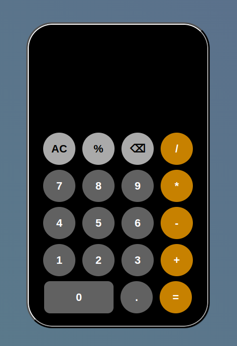

# IPHONE CALCULATOR

## The application can carry out the following:

- Additions (+)
- Subtraction (-)
- Multiplication (x)
- Division (/)
- Percent (%)

### This application is aim at:

- Carrying out correct calculations
- Being very efficient
- Relieving the user of need to do mental operations and need to rely on paper, so far as possible.

### screenshots of the application within the iphone XR.

|                                                      |                                                                |
| ---------------------------------------------------- | -------------------------------------------------------------- |
|  |  |
|                                                      |

## Tools used

- CSS
- HTML
- JavascriptJS
